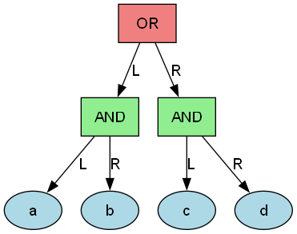
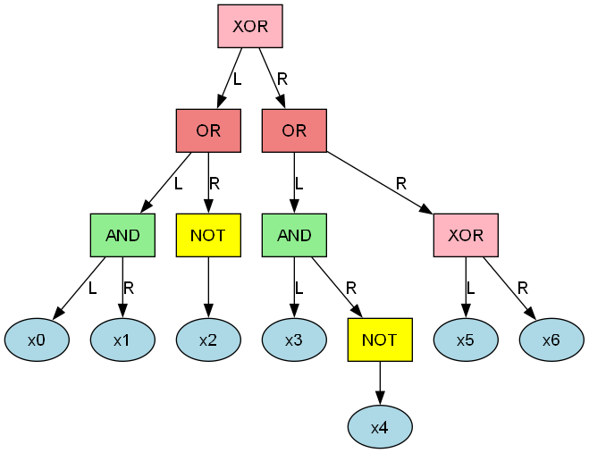

# Visualization Examples

The BDD Expression Converter generates both expression tree and BDD visualizations. Here are examples from our test expressions:

## Simple Expression: `(a AND b) OR (c AND d)`

**Expression Tree:**


**Resulting BDD:**


This basic expression shows how AND/OR operations are structured in the BDD with 4 variables (a, b, c, d) displayed with their actual names.

---

## Complex Expression: `((x0 AND x1) OR (NOT x2)) XOR ((x3 AND (NOT x4)) OR (x5 XOR x6))`

**Expression Tree:**


**Resulting BDD:**


This complex expression demonstrates all supported operators (AND, OR, NOT, XOR) with 7 variables (x0 through x6), showing how the BDD optimization reduces the structure while preserving logical equivalence.

---

## Scalability and Visualization Limits

The system can handle constraint satisfaction problems of varying complexity:

### Four Queens Problem
- **Variables**: 16 (4×4 grid positions)
- **BDD Nodes**: 95
- **Visualization**: Full PNG generation supported
- **File Size**: ~200 lines DOT format

### Six Queens Problem
- **Variables**: 36 (6×6 grid positions)
- **BDD Nodes**: 3,361
- **Visualization**: DOT format only (PNG generation impractical)
- **File Size**: ~17,000 lines DOT format

### Eight Queens Problem
- **Variables**: 64 (8×8 grid positions)
- **BDD Nodes**: 71,166
- **Visualization**: DOT format only (PNG generation impractical)
- **File Size**: ~350,000 lines DOT format

**Note**: For large BDD structures (>1,000 nodes), PNG visualization becomes impractical due to:
- Extremely large file sizes (potentially >100MB for 8-queens)
- Complex layouts that are illegible when rendered
- Memory requirements for image generation
- Processing time for layout algorithms

The 8-queens problem generates a 71,166-node BDD that, while computationally tractable, would produce an impractically large PNG file. For such cases, the DOT format files provide the complete graph structure that can be analyzed programmatically or with specialized graph analysis tools.

---

## Negated Expression: `NOT (a OR b) AND c`

**Expression Tree:**


**Resulting BDD:**


This example shows how NOT operations and De Morgan's laws are handled in the BDD representation with 3 variables (a, b, c) displayed with their actual names.

---

## Understanding the Visualizations

### Expression Trees (left diagrams)
- Show the parsed structure of your logical expression
- Reveal operator precedence and grouping
- Help debug complex expressions before BDD conversion

### Binary Decision Diagrams (right diagrams)
- Optimized representation for efficient logical operations
- Solid lines represent "true" paths, dashed lines represent "false" paths
- Terminal nodes show final boolean values (0 = false, 1 = true)
- Shared nodes indicate common subexpressions

## Real Variable Names

**Key Feature**: All outputs preserve the actual variable names from your expressions instead of using generic placeholders.

**Examples**:
- Expression `temperature AND humidity` displays variables as `temperature`, `humidity`
- Expression `(a AND b) OR c` shows variables as `a`, `b`, `c`
- Expression `x XOR y XOR z` uses variables `x`, `y`, `z`

**Benefits**:
- **Intuitive Debugging**: No mental mapping from x0→temperature required
- **Professional Visualizations**: Publication-ready graphs with meaningful labels
- **Consistent Output**: Same variable names across node tables, DOT files, and PNG images
- **Better Documentation**: Generated diagrams directly match your domain terminology

## Generating Visualizations

### Using Graphviz (Recommended)

1. Install Graphviz:
   ```powershell
   # Windows (using chocolatey)
   choco install graphviz

   # Windows (using winget)
   winget install Graphviz.Graphviz

   # Linux (Ubuntu/Debian)
   sudo apt install graphviz

   # macOS (using homebrew)
   brew install graphviz
   ```

2. Generate PNG visualizations:
   ```powershell
   # For expression tree
   dot -Tpng example_expression_tree.dot -o example_expression_tree.png

   # For BDD structure
   dot -Tpng example_bdd.dot -o example_bdd.png
   ```

### Batch PNG Generation

Use the provided PowerShell script to generate all PNG files:
```powershell
# Generate PNGs for all test expressions and any additional DOT files
.\scripts\generate_all_visualizations.ps1
```

This script automatically:
- Finds all DOT files in the project directory and subdirectories
- Generates corresponding PNG visualizations using Graphviz
- Provides detailed progress output and error handling
- Works with both expression tree and BDD DOT files
