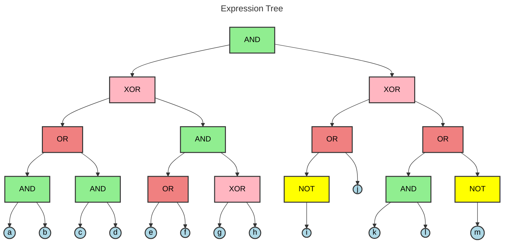
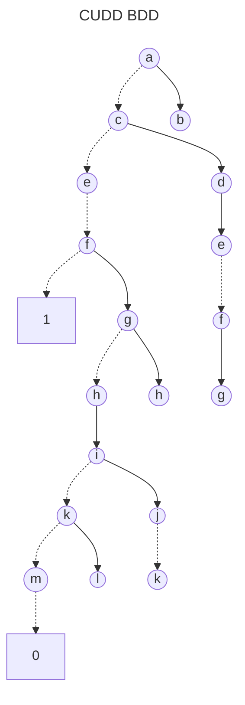

# BDD Analysis Report

## Original Expression

```
(((a AND b) OR (c AND d)) XOR ((e OR f) AND (g XOR h))) AND (((NOT i) OR j) XOR ((k AND l) OR (NOT m)))
```

## Expression Tree

The following diagram shows the parse tree of the logical expression:



## Binary Decision Diagram (BDD)

The following diagram shows the optimized BDD representation:



## Analysis Summary

- **Variables**: 13
- **BDD Nodes**: 18
- **Expression**: (((a AND b) OR (c AND d)) XOR ((e OR f) AND (g XOR h))) AND (((NOT i) OR j) XOR ((k AND l) OR (NOT m)))

## BDD Node Table

The following table shows the internal structure of the BDD with node relationships:

| Index | Variable | False Child | True Child | Type |
|-------|----------|-------------|------------|------|
| 0 | a | 2 | 1 | Variable |
| 1 | b | 2 | 4 | Variable |
| 2 | c | 7 | 3 | Variable |
| 3 | d | 7 | 4 | Variable |
| 4 | e | 5 | 6 | Variable |
| 5 | f | 12 | 6 | Variable |
| 6 | g | 10 | 11 | Variable |
| 7 | e | 8 | 9 | Variable |
| 8 | f | 19 | 9 | Variable |
| 9 | g | 11 | 10 | Variable |
| 10 | h | 12 | 19 | Variable |
| 11 | h | 19 | 12 | Variable |
| 12 | i | 15 | 13 | Variable |
| 13 | j | 14 | 15 | Variable |
| 14 | k | 17 | 16 | Variable |
| 15 | k | 17 | 16 | Variable |
| 16 | l | 17 | 19 | Variable |
| 17 | m | 18 | 19 | Variable |
| 18 | - | - | - | Terminal(0) |
| 19 | - | - | - | Terminal(1) |

**Note**: Nodes are ordered topologically (parents before children) with terminal nodes at the end.
