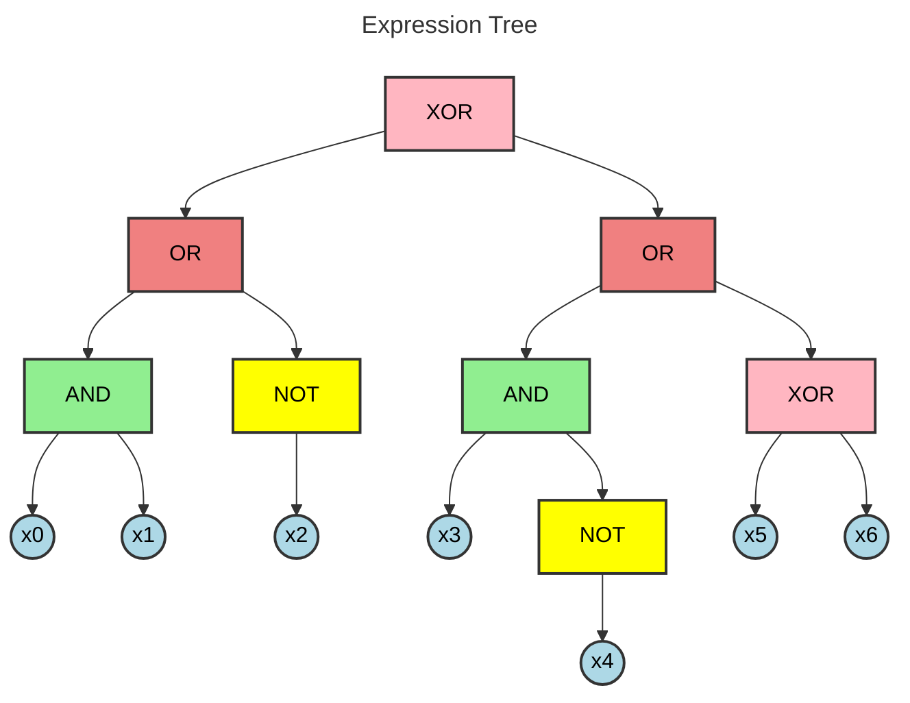
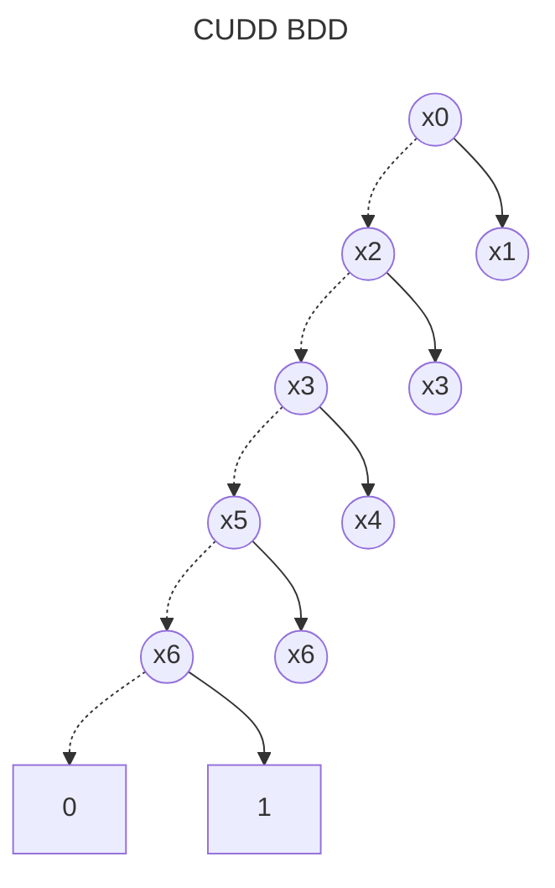

# BDD Analysis Report

## Original Expression

```
((x0 AND x1) OR (NOT x2)) XOR ((x3 AND (NOT x4)) OR (x5 XOR x6))
```

## Expression Tree

The following diagram shows the parse tree of the logical expression:



## Binary Decision Diagram (BDD)

The following diagram shows the optimized BDD representation:



## Analysis Summary

- **Variables**: 7
- **BDD Nodes**: 8
- **Expression**: ((x0 AND x1) OR (NOT x2)) XOR ((x3 AND (NOT x4)) OR (x5 XOR x6))

## BDD Node Table

The following table shows the internal structure of the BDD with node relationships:

| Index | Variable | False Child | True Child | Type |
|-------|----------|-------------|------------|------|
| 0 | x0 | 2 | 1 | Variable |
| 1 | x1 | 2 | 3 | Variable |
| 2 | x2 | 4 | 3 | Variable |
| 3 | x3 | 6 | 5 | Variable |
| 4 | x3 | 6 | 5 | Variable |
| 5 | x4 | 10 | 6 | Variable |
| 6 | x5 | 8 | 7 | Variable |
| 7 | x6 | 10 | 9 | Variable |
| 8 | x6 | 10 | 9 | Variable |
| 9 | - | - | - | Terminal(1) |
| 10 | - | - | - | Terminal(0) |

**Note**: Nodes are ordered topologically (parents before children) with terminal nodes at the end.
