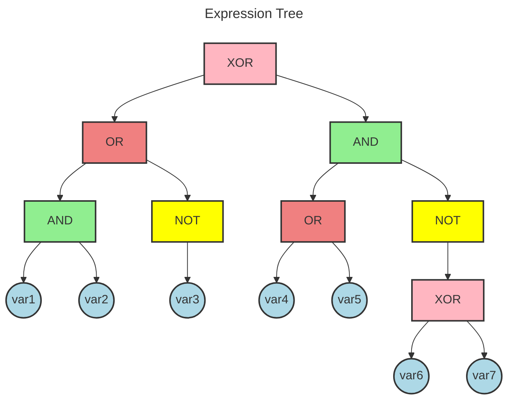
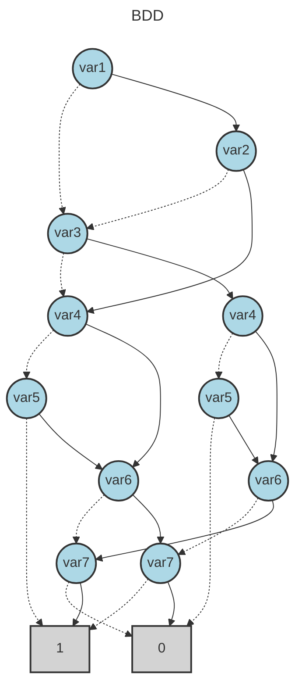

# BDD Analysis Report

## Original Expression

```
(var1 AND var2) OR (NOT var3) XOR (var4 OR var5) AND (NOT (var6 XOR var7))
```

## Expression Tree

The following diagram shows the parse tree of the logical expression:



## Binary Decision Diagram (BDD)

The following diagram shows the optimized BDD representation:



## Analysis Summary

- **Variables**: 7
- **BDD Nodes**: 13
- **Expression**: (var1 AND var2) OR (NOT var3) XOR (var4 OR var5) AND (NOT (var6 XOR var7))
