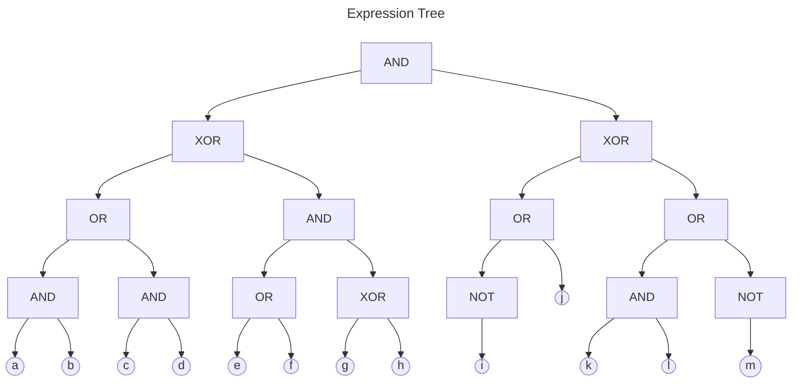
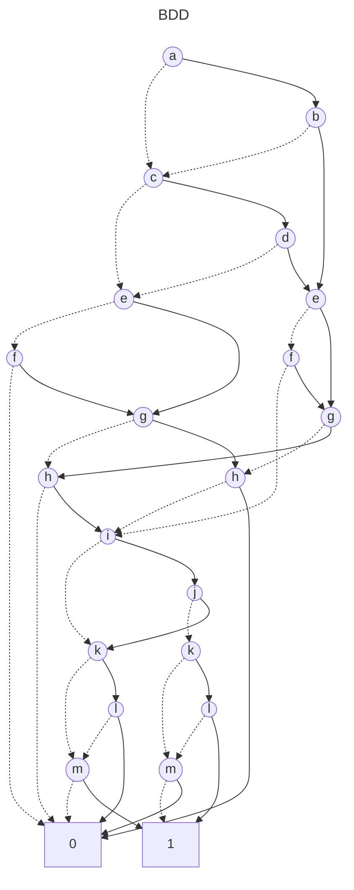

# BDD Analysis Report

## Original Expression

```
(((a AND b) OR (c AND d)) XOR ((e OR f) AND (g XOR h))) AND (((NOT i) OR j) XOR ((k AND l) OR (NOT m)))
```

## Expression Tree

The following diagram shows the parse tree of the logical expression:



## Binary Decision Diagram (BDD)

The following diagram shows the optimized BDD representation:



## Analysis Summary

- **Variables**: 13
- **BDD Nodes**: 22
- **Expression**: (((a AND b) OR (c AND d)) XOR ((e OR f) AND (g XOR h))) AND (((NOT i) OR j) XOR ((k AND l) OR (NOT m)))
