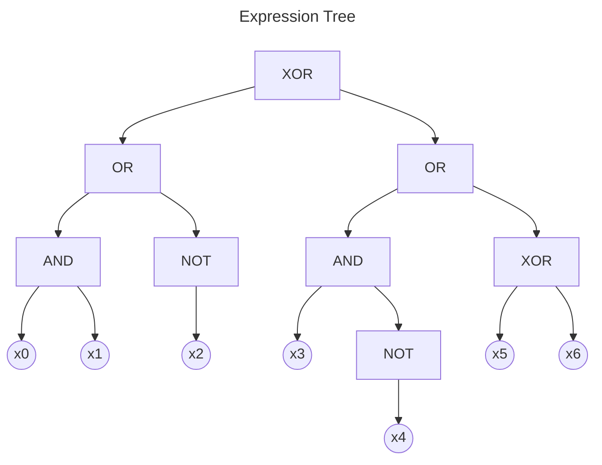
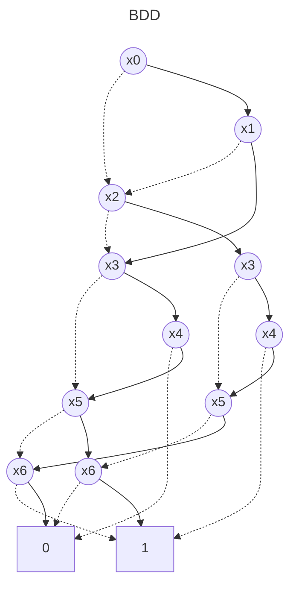

# BDD Analysis Report

## Original Expression

```
((x0 AND x1) OR (NOT x2)) XOR ((x3 AND (NOT x4)) OR (x5 XOR x6))
```

## Expression Tree

The following diagram shows the parse tree of the logical expression:



## Binary Decision Diagram (BDD)

The following diagram shows the optimized BDD representation:



## Analysis Summary

- **Variables**: 7
- **BDD Nodes**: 13
- **Expression**: ((x0 AND x1) OR (NOT x2)) XOR ((x3 AND (NOT x4)) OR (x5 XOR x6))
