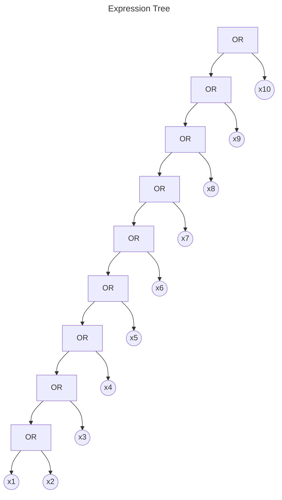
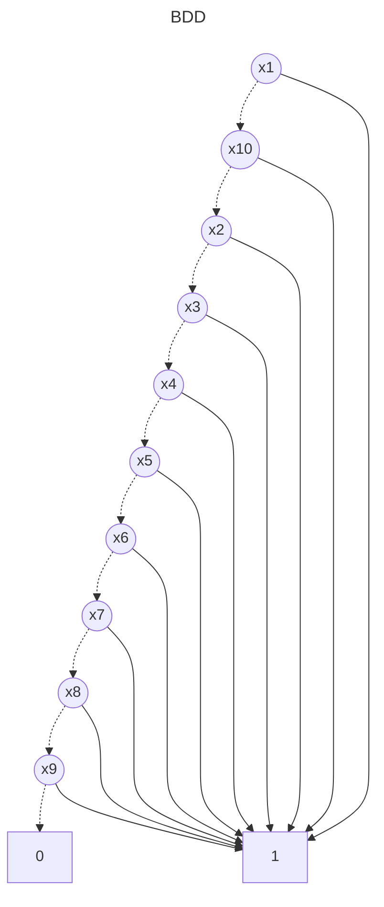

# BDD Analysis Report

## Original Expression

```
x1 OR x2 OR x3 OR x4 OR x5 OR x6 OR x7 OR x8 OR x9 OR x10
```

## Expression Tree

The following diagram shows the parse tree of the logical expression:



## Binary Decision Diagram (BDD)

The following diagram shows the optimized BDD representation:



## Analysis Summary

- **Variables**: 10
- **BDD Nodes**: 12
- **Expression**: x1 OR x2 OR x3 OR x4 OR x5 OR x6 OR x7 OR x8 OR x9 OR x10
