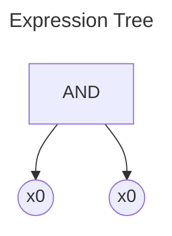
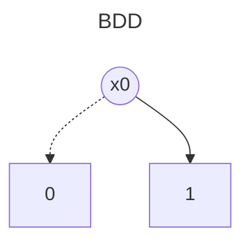

# BDD Analysis Report

## Original Expression

```
x0 AND x0
```

## Expression Tree

The following diagram shows the parse tree of the logical expression:



## Binary Decision Diagram (BDD)

The following diagram shows the optimized BDD representation:



## Analysis Summary

- **Variables**: 1
- **BDD Nodes**: 3
- **Expression**: x0 AND x0
