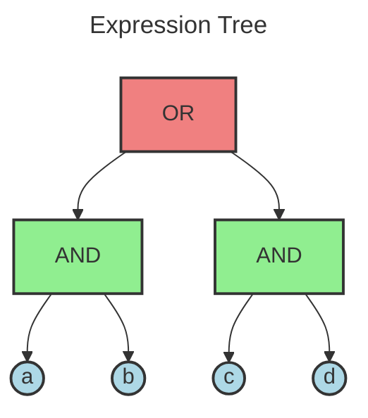
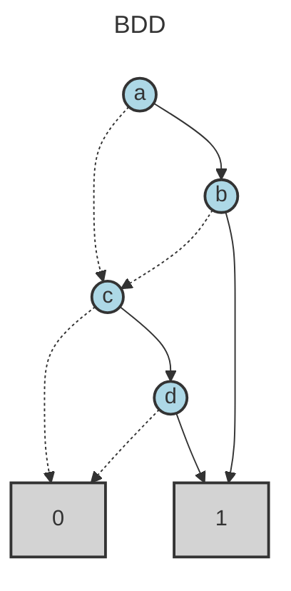

# BDD Analysis Report

## Original Expression

```
(a AND b) OR (c AND d)
```

## Expression Tree

The following diagram shows the parse tree of the logical expression:



## Binary Decision Diagram (BDD)

The following diagram shows the optimized BDD representation:



## Analysis Summary

- **Variables**: 4
- **BDD Nodes**: 6
- **Expression**: (a AND b) OR (c AND d)
