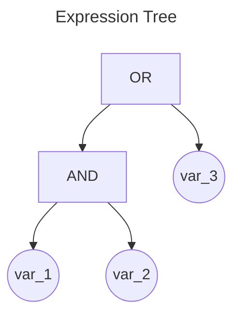
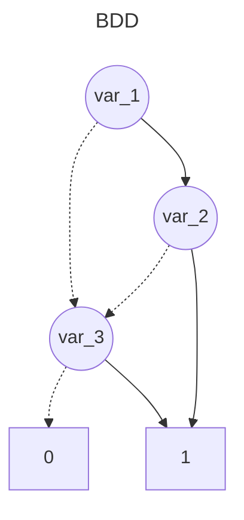

# BDD Analysis Report

## Original Expression

```
var_1 AND var_2 OR var_3
```

## Expression Tree

The following diagram shows the parse tree of the logical expression:



## Binary Decision Diagram (BDD)

The following diagram shows the optimized BDD representation:



## Analysis Summary

- **Variables**: 3
- **BDD Nodes**: 5
- **Expression**: var_1 AND var_2 OR var_3
