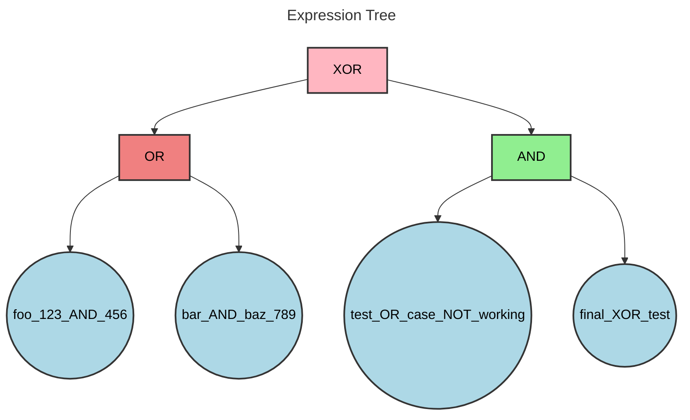
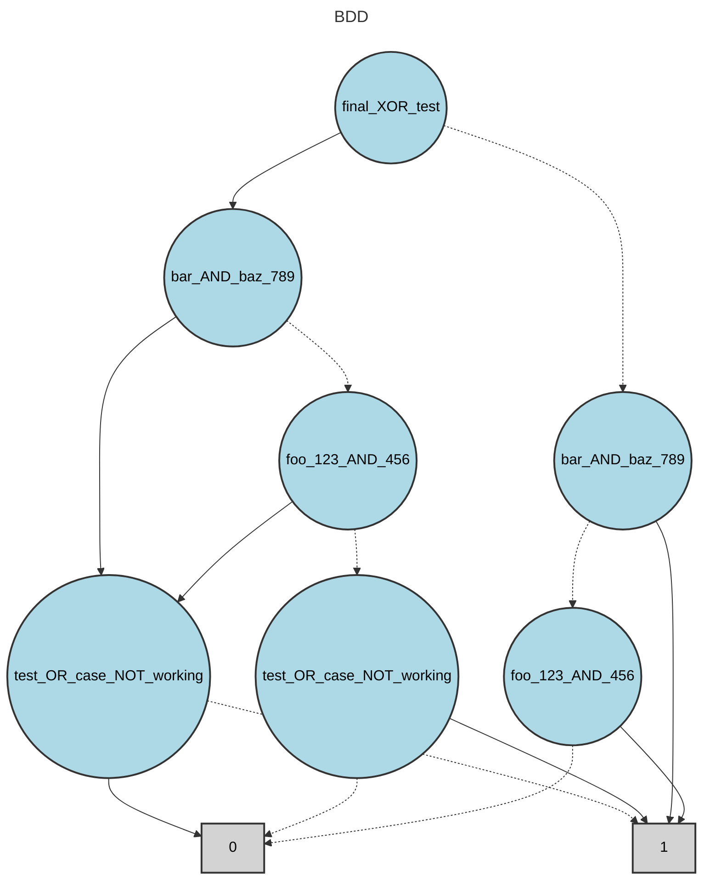

# BDD Analysis Report

## Original Expression

```
foo_123_AND_456 OR bar_AND_baz_789 XOR test_OR_case_NOT_working AND final_XOR_test
```

## Expression Tree

The following diagram shows the parse tree of the logical expression:



## Binary Decision Diagram (BDD)

The following diagram shows the optimized BDD representation:



## Analysis Summary

- **Variables**: 4
- **BDD Nodes**: 9
- **Expression**: foo_123_AND_456 OR bar_AND_baz_789 XOR test_OR_case_NOT_working AND final_XOR_test

## BDD Node Table

The following table shows the internal structure of the BDD with node relationships:

| Index | Variable | False Child | True Child | Type |
|-------|----------|-------------|------------|------|
| 0 | final_XOR_test | 5 | 1 | Variable |
| 1 | bar_AND_baz_789 | 2 | 3 | Variable |
| 2 | foo_123_AND_456 | 4 | 3 | Variable |
| 3 | test_OR_case_NOT_working | 7 | 8 | Variable |
| 4 | test_OR_case_NOT_working | 8 | 7 | Variable |
| 5 | bar_AND_baz_789 | 6 | 7 | Variable |
| 6 | foo_123_AND_456 | 8 | 7 | Variable |
| 7 | - | - | - | Terminal(1) |
| 8 | - | - | - | Terminal(0) |

**Note**: Nodes are ordered topologically (parents before children) with terminal nodes at the end.
