# BDD Analysis Report

## Original Expression

```
((q_1_1 XOR q_1_2) XOR (q_1_3 XOR q_1_4)) AND ((q_2_1 XOR q_2_2) XOR (q_2_3 XOR q_2_4)) AND ((q_3_1 XOR q_3_2) XOR (q_3_3 XOR q_3_4)) AND ((q_4_1 XOR q_4_2) XOR (q_4_3 XOR q_4_4)) AND ((q_1_1 XOR q_2_1) XOR (q_3_1 XOR q_4_1)) AND ((q_1_2 XOR q_2_2) XOR (q_3_2 XOR q_4_2)) AND ((q_1_3 XOR q_2_3) XOR (q_3_3 XOR q_4_3)) AND ((q_1_4 XOR q_2_4) XOR (q_3_4 XOR q_4_4)) AND (NOT (q_1_1 AND q_2_2) AND NOT (q_1_1 AND q_3_3) AND NOT (q_1_1 AND q_4_4) AND NOT (q_2_2 AND q_3_3) AND NOT (q_2_2 AND q_4_4) AND NOT (q_3_3 AND q_4_4)) AND (NOT (q_1_2 AND q_2_3) AND NOT (q_1_2 AND q_3_4) AND NOT (q_2_3 AND q_3_4)) AND (NOT (q_1_3 AND q_2_4)) AND (NOT (q_1_4 AND q_2_3) AND NOT (q_1_4 AND q_3_2) AND NOT (q_1_4 AND q_4_1) AND NOT (q_2_3 AND q_3_2) AND NOT (q_2_3 AND q_4_1) AND NOT (q_3_2 AND q_4_1)) AND (NOT (q_1_3 AND q_2_2) AND NOT (q_1_3 AND q_3_1) AND NOT (q_2_2 AND q_3_1)) AND (NOT (q_1_2 AND q_2_1))
```

## Expression Tree

The following diagram shows the parse tree of the logical expression:

```mermaid
---
title: Expression Tree
---
flowchart TD
    N1(("q_1_1"))
    N2(("q_1_2"))
    N3["XOR"]
    N4(("q_1_3"))
    N5(("q_1_4"))
    N6["XOR"]
    N7["XOR"]
    N8(("q_2_1"))
    N9(("q_2_2"))
    N10["XOR"]
    N11(("q_2_3"))
    N12(("q_2_4"))
    N13["XOR"]
    N14["XOR"]
    N15["AND"]
    N16(("q_3_1"))
    N17(("q_3_2"))
    N18["XOR"]
    N19(("q_3_3"))
    N20(("q_3_4"))
    N21["XOR"]
    N22["XOR"]
    N23["AND"]
    N24(("q_4_1"))
    N25(("q_4_2"))
    N26["XOR"]
    N27(("q_4_3"))
    N28(("q_4_4"))
    N29["XOR"]
    N30["XOR"]
    N31["AND"]
    N32(("q_1_1"))
    N33(("q_2_1"))
    N34["XOR"]
    N35(("q_3_1"))
    N36(("q_4_1"))
    N37["XOR"]
    N38["XOR"]
    N39["AND"]
    N40(("q_1_2"))
    N41(("q_2_2"))
    N42["XOR"]
    N43(("q_3_2"))
    N44(("q_4_2"))
    N45["XOR"]
    N46["XOR"]
    N47["AND"]
    N48(("q_1_3"))
    N49(("q_2_3"))
    N50["XOR"]
    N51(("q_3_3"))
    N52(("q_4_3"))
    N53["XOR"]
    N54["XOR"]
    N55["AND"]
    N56(("q_1_4"))
    N57(("q_2_4"))
    N58["XOR"]
    N59(("q_3_4"))
    N60(("q_4_4"))
    N61["XOR"]
    N62["XOR"]
    N63["AND"]
    N64(("q_1_1"))
    N65(("q_2_2"))
    N66["AND"]
    N67["NOT"]
    N68(("q_1_1"))
    N69(("q_3_3"))
    N70["AND"]
    N71["NOT"]
    N72["AND"]
    N73(("q_1_1"))
    N74(("q_4_4"))
    N75["AND"]
    N76["NOT"]
    N77["AND"]
    N78(("q_2_2"))
    N79(("q_3_3"))
    N80["AND"]
    N81["NOT"]
    N82["AND"]
    N83(("q_2_2"))
    N84(("q_4_4"))
    N85["AND"]
    N86["NOT"]
    N87["AND"]
    N88(("q_3_3"))
    N89(("q_4_4"))
    N90["AND"]
    N91["NOT"]
    N92["AND"]
    N93["AND"]
    N94(("q_1_2"))
    N95(("q_2_3"))
    N96["AND"]
    N97["NOT"]
    N98(("q_1_2"))
    N99(("q_3_4"))
    N100["AND"]
    N101["NOT"]
    N102["AND"]
    N103(("q_2_3"))
    N104(("q_3_4"))
    N105["AND"]
    N106["NOT"]
    N107["AND"]
    N108["AND"]
    N109(("q_1_3"))
    N110(("q_2_4"))
    N111["AND"]
    N112["NOT"]
    N113["AND"]
    N114(("q_1_4"))
    N115(("q_2_3"))
    N116["AND"]
    N117["NOT"]
    N118(("q_1_4"))
    N119(("q_3_2"))
    N120["AND"]
    N121["NOT"]
    N122["AND"]
    N123(("q_1_4"))
    N124(("q_4_1"))
    N125["AND"]
    N126["NOT"]
    N127["AND"]
    N128(("q_2_3"))
    N129(("q_3_2"))
    N130["AND"]
    N131["NOT"]
    N132["AND"]
    N133(("q_2_3"))
    N134(("q_4_1"))
    N135["AND"]
    N136["NOT"]
    N137["AND"]
    N138(("q_3_2"))
    N139(("q_4_1"))
    N140["AND"]
    N141["NOT"]
    N142["AND"]
    N143["AND"]
    N144(("q_1_3"))
    N145(("q_2_2"))
    N146["AND"]
    N147["NOT"]
    N148(("q_1_3"))
    N149(("q_3_1"))
    N150["AND"]
    N151["NOT"]
    N152["AND"]
    N153(("q_2_2"))
    N154(("q_3_1"))
    N155["AND"]
    N156["NOT"]
    N157["AND"]
    N158["AND"]
    N159(("q_1_2"))
    N160(("q_2_1"))
    N161["AND"]
    N162["NOT"]
    N163["AND"]

    N3 --> N1
    N3 --> N2
    N6 --> N4
    N6 --> N5
    N7 --> N3
    N7 --> N6
    N10 --> N8
    N10 --> N9
    N13 --> N11
    N13 --> N12
    N14 --> N10
    N14 --> N13
    N15 --> N7
    N15 --> N14
    N18 --> N16
    N18 --> N17
    N21 --> N19
    N21 --> N20
    N22 --> N18
    N22 --> N21
    N23 --> N15
    N23 --> N22
    N26 --> N24
    N26 --> N25
    N29 --> N27
    N29 --> N28
    N30 --> N26
    N30 --> N29
    N31 --> N23
    N31 --> N30
    N34 --> N32
    N34 --> N33
    N37 --> N35
    N37 --> N36
    N38 --> N34
    N38 --> N37
    N39 --> N31
    N39 --> N38
    N42 --> N40
    N42 --> N41
    N45 --> N43
    N45 --> N44
    N46 --> N42
    N46 --> N45
    N47 --> N39
    N47 --> N46
    N50 --> N48
    N50 --> N49
    N53 --> N51
    N53 --> N52
    N54 --> N50
    N54 --> N53
    N55 --> N47
    N55 --> N54
    N58 --> N56
    N58 --> N57
    N61 --> N59
    N61 --> N60
    N62 --> N58
    N62 --> N61
    N63 --> N55
    N63 --> N62
    N66 --> N64
    N66 --> N65
    N67 --> N66
    N70 --> N68
    N70 --> N69
    N71 --> N70
    N72 --> N67
    N72 --> N71
    N75 --> N73
    N75 --> N74
    N76 --> N75
    N77 --> N72
    N77 --> N76
    N80 --> N78
    N80 --> N79
    N81 --> N80
    N82 --> N77
    N82 --> N81
    N85 --> N83
    N85 --> N84
    N86 --> N85
    N87 --> N82
    N87 --> N86
    N90 --> N88
    N90 --> N89
    N91 --> N90
    N92 --> N87
    N92 --> N91
    N93 --> N63
    N93 --> N92
    N96 --> N94
    N96 --> N95
    N97 --> N96
    N100 --> N98
    N100 --> N99
    N101 --> N100
    N102 --> N97
    N102 --> N101
    N105 --> N103
    N105 --> N104
    N106 --> N105
    N107 --> N102
    N107 --> N106
    N108 --> N93
    N108 --> N107
    N111 --> N109
    N111 --> N110
    N112 --> N111
    N113 --> N108
    N113 --> N112
    N116 --> N114
    N116 --> N115
    N117 --> N116
    N120 --> N118
    N120 --> N119
    N121 --> N120
    N122 --> N117
    N122 --> N121
    N125 --> N123
    N125 --> N124
    N126 --> N125
    N127 --> N122
    N127 --> N126
    N130 --> N128
    N130 --> N129
    N131 --> N130
    N132 --> N127
    N132 --> N131
    N135 --> N133
    N135 --> N134
    N136 --> N135
    N137 --> N132
    N137 --> N136
    N140 --> N138
    N140 --> N139
    N141 --> N140
    N142 --> N137
    N142 --> N141
    N143 --> N113
    N143 --> N142
    N146 --> N144
    N146 --> N145
    N147 --> N146
    N150 --> N148
    N150 --> N149
    N151 --> N150
    N152 --> N147
    N152 --> N151
    N155 --> N153
    N155 --> N154
    N156 --> N155
    N157 --> N152
    N157 --> N156
    N158 --> N143
    N158 --> N157
    N161 --> N159
    N161 --> N160
    N162 --> N161
    N163 --> N158
    N163 --> N162

    class N1 variable
    class N2 variable
    class N3 xorOp
    class N4 variable
    class N5 variable
    class N6 xorOp
    class N7 xorOp
    class N8 variable
    class N9 variable
    class N10 xorOp
    class N11 variable
    class N12 variable
    class N13 xorOp
    class N14 xorOp
    class N15 andOp
    class N16 variable
    class N17 variable
    class N18 xorOp
    class N19 variable
    class N20 variable
    class N21 xorOp
    class N22 xorOp
    class N23 andOp
    class N24 variable
    class N25 variable
    class N26 xorOp
    class N27 variable
    class N28 variable
    class N29 xorOp
    class N30 xorOp
    class N31 andOp
    class N32 variable
    class N33 variable
    class N34 xorOp
    class N35 variable
    class N36 variable
    class N37 xorOp
    class N38 xorOp
    class N39 andOp
    class N40 variable
    class N41 variable
    class N42 xorOp
    class N43 variable
    class N44 variable
    class N45 xorOp
    class N46 xorOp
    class N47 andOp
    class N48 variable
    class N49 variable
    class N50 xorOp
    class N51 variable
    class N52 variable
    class N53 xorOp
    class N54 xorOp
    class N55 andOp
    class N56 variable
    class N57 variable
    class N58 xorOp
    class N59 variable
    class N60 variable
    class N61 xorOp
    class N62 xorOp
    class N63 andOp
    class N64 variable
    class N65 variable
    class N66 andOp
    class N67 notOp
    class N68 variable
    class N69 variable
    class N70 andOp
    class N71 notOp
    class N72 andOp
    class N73 variable
    class N74 variable
    class N75 andOp
    class N76 notOp
    class N77 andOp
    class N78 variable
    class N79 variable
    class N80 andOp
    class N81 notOp
    class N82 andOp
    class N83 variable
    class N84 variable
    class N85 andOp
    class N86 notOp
    class N87 andOp
    class N88 variable
    class N89 variable
    class N90 andOp
    class N91 notOp
    class N92 andOp
    class N93 andOp
    class N94 variable
    class N95 variable
    class N96 andOp
    class N97 notOp
    class N98 variable
    class N99 variable
    class N100 andOp
    class N101 notOp
    class N102 andOp
    class N103 variable
    class N104 variable
    class N105 andOp
    class N106 notOp
    class N107 andOp
    class N108 andOp
    class N109 variable
    class N110 variable
    class N111 andOp
    class N112 notOp
    class N113 andOp
    class N114 variable
    class N115 variable
    class N116 andOp
    class N117 notOp
    class N118 variable
    class N119 variable
    class N120 andOp
    class N121 notOp
    class N122 andOp
    class N123 variable
    class N124 variable
    class N125 andOp
    class N126 notOp
    class N127 andOp
    class N128 variable
    class N129 variable
    class N130 andOp
    class N131 notOp
    class N132 andOp
    class N133 variable
    class N134 variable
    class N135 andOp
    class N136 notOp
    class N137 andOp
    class N138 variable
    class N139 variable
    class N140 andOp
    class N141 notOp
    class N142 andOp
    class N143 andOp
    class N144 variable
    class N145 variable
    class N146 andOp
    class N147 notOp
    class N148 variable
    class N149 variable
    class N150 andOp
    class N151 notOp
    class N152 andOp
    class N153 variable
    class N154 variable
    class N155 andOp
    class N156 notOp
    class N157 andOp
    class N158 andOp
    class N159 variable
    class N160 variable
    class N161 andOp
    class N162 notOp
    class N163 andOp

    classDef variable fill:lightblue,stroke:#333,stroke-width:2px,color:#000
    classDef andOp fill:lightgreen,stroke:#333,stroke-width:2px,color:#000
    classDef orOp fill:lightcoral,stroke:#333,stroke-width:2px,color:#000
    classDef notOp fill:yellow,stroke:#333,stroke-width:2px,color:#000
    classDef xorOp fill:lightpink,stroke:#333,stroke-width:2px,color:#000
```



## Binary Decision Diagram (BDD)

The following diagram shows the optimized BDD representation:

```mermaid
---
title: BDD
---
flowchart TD
    N0["0"]
    N1["1"]
    N2(("q_4_4"))
    N3(("q_4_3"))
    N4(("q_4_2"))
    N5(("q_4_1"))
    N6(("q_3_4"))
    N7(("q_4_4"))
    N8(("q_4_3"))
    N9(("q_4_2"))
    N10(("q_4_1"))
    N11(("q_3_4"))
    N12(("q_3_3"))
    N13(("q_3_2"))
    N14(("q_3_1"))
    N15(("q_2_4"))
    N16(("q_2_3"))
    N17(("q_2_2"))
    N18(("q_3_4"))
    N19(("q_3_4"))
    N20(("q_3_3"))
    N21(("q_3_2"))
    N22(("q_3_1"))
    N23(("q_2_4"))
    N24(("q_2_3"))
    N25(("q_4_3"))
    N26(("q_4_2"))
    N27(("q_4_1"))
    N28(("q_3_4"))
    N29(("q_3_3"))
    N30(("q_3_2"))
    N31(("q_3_1"))
    N32(("q_2_4"))
    N33(("q_2_3"))
    N34(("q_2_2"))
    N35(("q_2_1"))
    N36(("q_1_4"))
    N37(("q_3_3"))
    N38(("q_4_3"))
    N39(("q_4_2"))
    N40(("q_4_1"))
    N41(("q_3_4"))
    N42(("q_3_3"))
    N43(("q_3_2"))
    N44(("q_3_1"))
    N45(("q_2_4"))
    N46(("q_2_3"))
    N47(("q_2_2"))
    N48(("q_2_1"))
    N49(("q_1_4"))
    N50(("q_1_3"))
    N51(("q_4_2"))
    N52(("q_4_1"))
    N53(("q_3_4"))
    N54(("q_3_3"))
    N55(("q_3_2"))
    N56(("q_3_4"))
    N57(("q_3_3"))
    N58(("q_3_3"))
    N59(("q_3_2"))
    N60(("q_3_1"))
    N61(("q_2_4"))
    N62(("q_2_3"))
    N63(("q_2_2"))
    N64(("q_2_1"))
    N65(("q_1_4"))
    N66(("q_1_3"))
    N67(("q_1_2"))
    N68(("q_3_2"))
    N69(("q_4_2"))
    N70(("q_4_1"))
    N71(("q_3_4"))
    N72(("q_3_3"))
    N73(("q_3_2"))
    N74(("q_3_1"))
    N75(("q_2_4"))
    N76(("q_2_3"))
    N77(("q_2_2"))
    N78(("q_3_4"))
    N79(("q_3_3"))
    N80(("q_3_2"))
    N81(("q_3_2"))
    N82(("q_3_1"))
    N83(("q_2_4"))
    N84(("q_3_3"))
    N85(("q_3_2"))
    N86(("q_3_1"))
    N87(("q_2_4"))
    N88(("q_2_3"))
    N89(("q_2_2"))
    N90(("q_2_1"))
    N91(("q_1_4"))
    N92(("q_1_3"))
    N93(("q_1_2"))
    N94(("q_1_1"))

    N2 -.-> N0
    N2 --> N1
    N3 -.-> N0
    N3 --> N2
    N4 -.-> N0
    N4 --> N3
    N5 -.-> N4
    N5 --> N0
    N6 -.-> N5
    N6 --> N0
    N7 -.-> N1
    N7 --> N0
    N8 -.-> N7
    N8 --> N0
    N9 -.-> N0
    N9 --> N8
    N10 -.-> N9
    N10 --> N0
    N11 -.-> N0
    N11 --> N10
    N12 -.-> N6
    N12 --> N11
    N13 -.-> N12
    N13 --> N0
    N14 -.-> N0
    N14 --> N13
    N15 -.-> N0
    N15 --> N14
    N16 -.-> N15
    N16 --> N0
    N17 -.-> N16
    N17 --> N0
    N18 -.-> N0
    N18 --> N5
    N19 -.-> N10
    N19 --> N0
    N20 -.-> N18
    N20 --> N19
    N21 -.-> N20
    N21 --> N0
    N22 -.-> N21
    N22 --> N0
    N23 -.-> N22
    N23 --> N0
    N24 -.-> N23
    N24 --> N0
    N25 -.-> N0
    N25 --> N7
    N26 -.-> N25
    N26 --> N0
    N27 -.-> N26
    N27 --> N0
    N28 -.-> N0
    N28 --> N27
    N29 -.-> N28
    N29 --> N0
    N30 -.-> N29
    N30 --> N0
    N31 -.-> N30
    N31 --> N0
    N32 -.-> N0
    N32 --> N31
    N33 -.-> N32
    N33 --> N0
    N34 -.-> N24
    N34 --> N33
    N35 -.-> N17
    N35 --> N34
    N36 -.-> N0
    N36 --> N35
    N37 -.-> N11
    N37 --> N0
    N38 -.-> N2
    N38 --> N0
    N39 -.-> N38
    N39 --> N0
    N40 -.-> N39
    N40 --> N0
    N41 -.-> N40
    N41 --> N0
    N42 -.-> N41
    N42 --> N28
    N43 -.-> N37
    N43 --> N42
    N44 -.-> N43
    N44 --> N0
    N45 -.-> N44
    N45 --> N0
    N46 -.-> N45
    N46 --> N0
    N47 -.-> N46
    N47 --> N0
    N48 -.-> N0
    N48 --> N47
    N49 -.-> N48
    N49 --> N0
    N50 -.-> N36
    N50 --> N49
    N51 -.-> N8
    N51 --> N0
    N52 -.-> N0
    N52 --> N51
    N53 -.-> N52
    N53 --> N0
    N54 -.-> N0
    N54 --> N53
    N55 -.-> N54
    N55 --> N0
    N56 -.-> N27
    N56 --> N0
    N57 -.-> N56
    N57 --> N0
    N58 -.-> N0
    N58 --> N19
    N59 -.-> N57
    N59 --> N58
    N60 -.-> N55
    N60 --> N59
    N61 -.-> N0
    N61 --> N60
    N62 -.-> N61
    N62 --> N0
    N63 -.-> N62
    N63 --> N0
    N64 -.-> N63
    N64 --> N0
    N65 -.-> N64
    N65 --> N0
    N66 -.-> N65
    N66 --> N0
    N67 -.-> N50
    N67 --> N66
    N68 -.-> N0
    N68 --> N57
    N69 -.-> N0
    N69 --> N25
    N70 -.-> N0
    N70 --> N69
    N71 -.-> N70
    N71 --> N0
    N72 -.-> N71
    N72 --> N0
    N73 -.-> N72
    N73 --> N0
    N74 -.-> N68
    N74 --> N73
    N75 -.-> N0
    N75 --> N74
    N76 -.-> N75
    N76 --> N0
    N77 -.-> N76
    N77 --> N0
    N78 -.-> N0
    N78 --> N70
    N79 -.-> N78
    N79 --> N0
    N80 -.-> N79
    N80 --> N0
    N81 -.-> N0
    N81 --> N29
    N82 -.-> N80
    N82 --> N81
    N83 -.-> N82
    N83 --> N0
    N84 -.-> N19
    N84 --> N0
    N85 -.-> N84
    N85 --> N0
    N86 -.-> N0
    N86 --> N85
    N87 -.-> N0
    N87 --> N86
    N88 -.-> N83
    N88 --> N87
    N89 -.-> N88
    N89 --> N0
    N90 -.-> N77
    N90 --> N89
    N91 -.-> N90
    N91 --> N0
    N92 -.-> N91
    N92 --> N0
    N93 -.-> N92
    N93 --> N0
    N94 -.-> N67
    N94 --> N93

    class N0 terminal
    class N1 terminal
    class N2 bddVariable
    class N3 bddVariable
    class N4 bddVariable
    class N5 bddVariable
    class N6 bddVariable
    class N7 bddVariable
    class N8 bddVariable
    class N9 bddVariable
    class N10 bddVariable
    class N11 bddVariable
    class N12 bddVariable
    class N13 bddVariable
    class N14 bddVariable
    class N15 bddVariable
    class N16 bddVariable
    class N17 bddVariable
    class N18 bddVariable
    class N19 bddVariable
    class N20 bddVariable
    class N21 bddVariable
    class N22 bddVariable
    class N23 bddVariable
    class N24 bddVariable
    class N25 bddVariable
    class N26 bddVariable
    class N27 bddVariable
    class N28 bddVariable
    class N29 bddVariable
    class N30 bddVariable
    class N31 bddVariable
    class N32 bddVariable
    class N33 bddVariable
    class N34 bddVariable
    class N35 bddVariable
    class N36 bddVariable
    class N37 bddVariable
    class N38 bddVariable
    class N39 bddVariable
    class N40 bddVariable
    class N41 bddVariable
    class N42 bddVariable
    class N43 bddVariable
    class N44 bddVariable
    class N45 bddVariable
    class N46 bddVariable
    class N47 bddVariable
    class N48 bddVariable
    class N49 bddVariable
    class N50 bddVariable
    class N51 bddVariable
    class N52 bddVariable
    class N53 bddVariable
    class N54 bddVariable
    class N55 bddVariable
    class N56 bddVariable
    class N57 bddVariable
    class N58 bddVariable
    class N59 bddVariable
    class N60 bddVariable
    class N61 bddVariable
    class N62 bddVariable
    class N63 bddVariable
    class N64 bddVariable
    class N65 bddVariable
    class N66 bddVariable
    class N67 bddVariable
    class N68 bddVariable
    class N69 bddVariable
    class N70 bddVariable
    class N71 bddVariable
    class N72 bddVariable
    class N73 bddVariable
    class N74 bddVariable
    class N75 bddVariable
    class N76 bddVariable
    class N77 bddVariable
    class N78 bddVariable
    class N79 bddVariable
    class N80 bddVariable
    class N81 bddVariable
    class N82 bddVariable
    class N83 bddVariable
    class N84 bddVariable
    class N85 bddVariable
    class N86 bddVariable
    class N87 bddVariable
    class N88 bddVariable
    class N89 bddVariable
    class N90 bddVariable
    class N91 bddVariable
    class N92 bddVariable
    class N93 bddVariable
    class N94 bddVariable

    classDef bddVariable fill:lightblue,stroke:#333,stroke-width:2px,color:#000
    classDef terminal fill:lightgray,stroke:#333,stroke-width:2px,color:#000
```



## Analysis Summary

- **Variables**: 16
- **BDD Nodes**: 95
- **Expression**: ((q_1_1 XOR q_1_2) XOR (q_1_3 XOR q_1_4)) AND ((q_2_1 XOR q_2_2) XOR (q_2_3 XOR q_2_4)) AND ((q_3_1 XOR q_3_2) XOR (q_3_3 XOR q_3_4)) AND ((q_4_1 XOR q_4_2) XOR (q_4_3 XOR q_4_4)) AND ((q_1_1 XOR q_2_1) XOR (q_3_1 XOR q_4_1)) AND ((q_1_2 XOR q_2_2) XOR (q_3_2 XOR q_4_2)) AND ((q_1_3 XOR q_2_3) XOR (q_3_3 XOR q_4_3)) AND ((q_1_4 XOR q_2_4) XOR (q_3_4 XOR q_4_4)) AND (NOT (q_1_1 AND q_2_2) AND NOT (q_1_1 AND q_3_3) AND NOT (q_1_1 AND q_4_4) AND NOT (q_2_2 AND q_3_3) AND NOT (q_2_2 AND q_4_4) AND NOT (q_3_3 AND q_4_4)) AND (NOT (q_1_2 AND q_2_3) AND NOT (q_1_2 AND q_3_4) AND NOT (q_2_3 AND q_3_4)) AND (NOT (q_1_3 AND q_2_4)) AND (NOT (q_1_4 AND q_2_3) AND NOT (q_1_4 AND q_3_2) AND NOT (q_1_4 AND q_4_1) AND NOT (q_2_3 AND q_3_2) AND NOT (q_2_3 AND q_4_1) AND NOT (q_3_2 AND q_4_1)) AND (NOT (q_1_3 AND q_2_2) AND NOT (q_1_3 AND q_3_1) AND NOT (q_2_2 AND q_3_1)) AND (NOT (q_1_2 AND q_2_1))

## BDD Node Table

The following table shows the internal structure of the BDD with node relationships:

| Index | Variable | False Child | True Child | Type |
|-------|----------|-------------|------------|------|
| 0 | q_1_1 | 27 | 1 | Variable |
| 1 | q_1_2 | 2 | 94 | Variable |
| 2 | q_1_3 | 3 | 94 | Variable |
| 3 | q_1_4 | 4 | 94 | Variable |
| 4 | q_2_1 | 17 | 5 | Variable |
| 5 | q_2_2 | 6 | 94 | Variable |
| 6 | q_2_3 | 11 | 7 | Variable |
| 7 | q_2_4 | 94 | 8 | Variable |
| 8 | q_3_1 | 94 | 9 | Variable |
| 9 | q_3_2 | 10 | 94 | Variable |
| 10 | q_3_3 | 75 | 94 | Variable |
| 11 | q_2_4 | 12 | 94 | Variable |
| 12 | q_3_1 | 14 | 13 | Variable |
| 13 | q_3_2 | 94 | 65 | Variable |
| 14 | q_3_2 | 15 | 94 | Variable |
| 15 | q_3_3 | 16 | 94 | Variable |
| 16 | q_3_4 | 94 | 24 | Variable |
| 17 | q_2_2 | 18 | 94 | Variable |
| 18 | q_2_3 | 19 | 94 | Variable |
| 19 | q_2_4 | 94 | 20 | Variable |
| 20 | q_3_1 | 26 | 21 | Variable |
| 21 | q_3_2 | 22 | 94 | Variable |
| 22 | q_3_3 | 23 | 94 | Variable |
| 23 | q_3_4 | 24 | 94 | Variable |
| 24 | q_4_1 | 94 | 25 | Variable |
| 25 | q_4_2 | 94 | 69 | Variable |
| 26 | q_3_2 | 94 | 37 | Variable |
| 27 | q_1_2 | 44 | 28 | Variable |
| 28 | q_1_3 | 29 | 94 | Variable |
| 29 | q_1_4 | 30 | 94 | Variable |
| 30 | q_2_1 | 31 | 94 | Variable |
| 31 | q_2_2 | 32 | 94 | Variable |
| 32 | q_2_3 | 33 | 94 | Variable |
| 33 | q_2_4 | 94 | 34 | Variable |
| 34 | q_3_1 | 39 | 35 | Variable |
| 35 | q_3_2 | 37 | 36 | Variable |
| 36 | q_3_3 | 94 | 75 | Variable |
| 37 | q_3_3 | 38 | 94 | Variable |
| 38 | q_3_4 | 67 | 94 | Variable |
| 39 | q_3_2 | 40 | 94 | Variable |
| 40 | q_3_3 | 94 | 41 | Variable |
| 41 | q_3_4 | 42 | 94 | Variable |
| 42 | q_4_1 | 94 | 43 | Variable |
| 43 | q_4_2 | 86 | 94 | Variable |
| 44 | q_1_3 | 58 | 45 | Variable |
| 45 | q_1_4 | 46 | 94 | Variable |
| 46 | q_2_1 | 94 | 47 | Variable |
| 47 | q_2_2 | 48 | 94 | Variable |
| 48 | q_2_3 | 49 | 94 | Variable |
| 49 | q_2_4 | 50 | 94 | Variable |
| 50 | q_3_1 | 51 | 94 | Variable |
| 51 | q_3_2 | 57 | 52 | Variable |
| 52 | q_3_3 | 53 | 66 | Variable |
| 53 | q_3_4 | 54 | 94 | Variable |
| 54 | q_4_1 | 55 | 94 | Variable |
| 55 | q_4_2 | 56 | 94 | Variable |
| 56 | q_4_3 | 92 | 94 | Variable |
| 57 | q_3_3 | 83 | 94 | Variable |
| 58 | q_1_4 | 94 | 59 | Variable |
| 59 | q_2_1 | 77 | 60 | Variable |
| 60 | q_2_2 | 70 | 61 | Variable |
| 61 | q_2_3 | 62 | 94 | Variable |
| 62 | q_2_4 | 94 | 63 | Variable |
| 63 | q_3_1 | 64 | 94 | Variable |
| 64 | q_3_2 | 65 | 94 | Variable |
| 65 | q_3_3 | 66 | 94 | Variable |
| 66 | q_3_4 | 94 | 67 | Variable |
| 67 | q_4_1 | 68 | 94 | Variable |
| 68 | q_4_2 | 69 | 94 | Variable |
| 69 | q_4_3 | 94 | 87 | Variable |
| 70 | q_2_3 | 71 | 94 | Variable |
| 71 | q_2_4 | 72 | 94 | Variable |
| 72 | q_3_1 | 73 | 94 | Variable |
| 73 | q_3_2 | 74 | 94 | Variable |
| 74 | q_3_3 | 76 | 75 | Variable |
| 75 | q_3_4 | 84 | 94 | Variable |
| 76 | q_3_4 | 94 | 89 | Variable |
| 77 | q_2_2 | 78 | 94 | Variable |
| 78 | q_2_3 | 79 | 94 | Variable |
| 79 | q_2_4 | 94 | 80 | Variable |
| 80 | q_3_1 | 94 | 81 | Variable |
| 81 | q_3_2 | 82 | 94 | Variable |
| 82 | q_3_3 | 88 | 83 | Variable |
| 83 | q_3_4 | 94 | 84 | Variable |
| 84 | q_4_1 | 85 | 94 | Variable |
| 85 | q_4_2 | 94 | 86 | Variable |
| 86 | q_4_3 | 87 | 94 | Variable |
| 87 | q_4_4 | 93 | 94 | Variable |
| 88 | q_3_4 | 89 | 94 | Variable |
| 89 | q_4_1 | 90 | 94 | Variable |
| 90 | q_4_2 | 94 | 91 | Variable |
| 91 | q_4_3 | 94 | 92 | Variable |
| 92 | q_4_4 | 94 | 93 | Variable |
| 93 | - | - | - | Terminal(1) |
| 94 | - | - | - | Terminal(0) |

**Note**: Nodes are ordered topologically (parents before children) with terminal nodes at the end.
