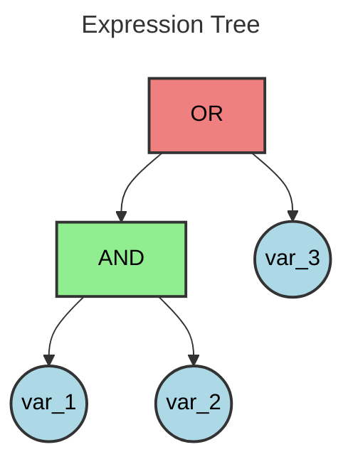
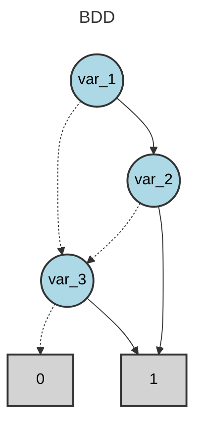

# BDD Analysis Report

## Original Expression

```
var_1 AND var_2 OR var_3
```

## Expression Tree

The following diagram shows the parse tree of the logical expression:



## Binary Decision Diagram (BDD)

The following diagram shows the optimized BDD representation:



## Analysis Summary

- **Variables**: 3
- **BDD Nodes**: 5
- **Expression**: var_1 AND var_2 OR var_3

## BDD Node Table

The following table shows the internal structure of the BDD with node relationships:

| Index | Variable | False Child | True Child | Type |
|-------|----------|-------------|------------|------|
| 0 | var_1 | 2 | 1 | Variable |
| 1 | var_2 | 2 | 3 | Variable |
| 2 | var_3 | 4 | 3 | Variable |
| 3 | - | - | - | Terminal(1) |
| 4 | - | - | - | Terminal(0) |

**Note**: Nodes are ordered topologically (parents before children) with terminal nodes at the end.
