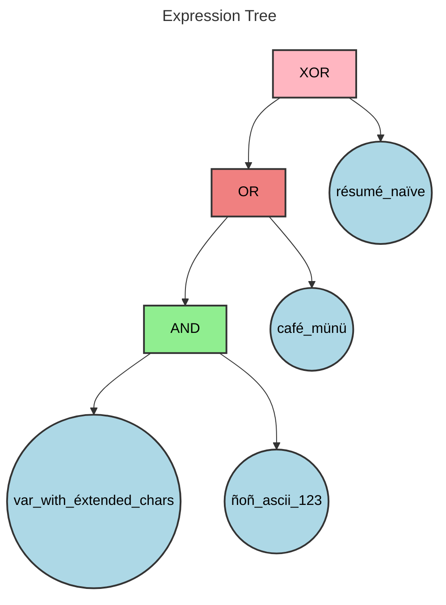
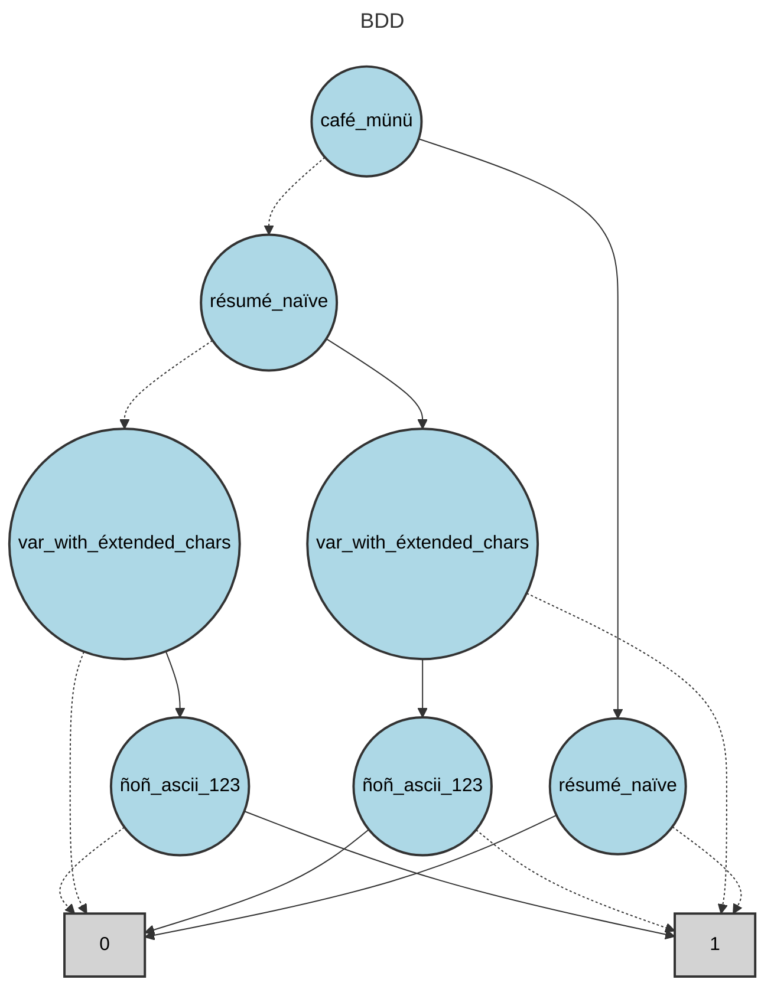

# BDD Analysis Report

## Original Expression

```
var_with_éxtended_chars AND ñoñ_ascii_123 OR café_münü XOR résumé_naïve
```

## Expression Tree

The following diagram shows the parse tree of the logical expression:



## Binary Decision Diagram (BDD)

The following diagram shows the optimized BDD representation:



## Analysis Summary

- **Variables**: 4
- **BDD Nodes**: 9
- **Expression**: var_with_éxtended_chars AND ñoñ_ascii_123 OR café_münü XOR résumé_naïve

## BDD Node Table

The following table shows the internal structure of the BDD with node relationships:

| Index | Variable | False Child | True Child | Type |
|-------|----------|-------------|------------|------|
| 0 | café_münü | 2 | 1 | Variable |
| 1 | résumé_naïve | 7 | 8 | Variable |
| 2 | résumé_naïve | 5 | 3 | Variable |
| 3 | var_with_éxtended_chars | 7 | 4 | Variable |
| 4 | ñoñ_ascii_123 | 7 | 8 | Variable |
| 5 | var_with_éxtended_chars | 8 | 6 | Variable |
| 6 | ñoñ_ascii_123 | 8 | 7 | Variable |
| 7 | - | - | - | Terminal(1) |
| 8 | - | - | - | Terminal(0) |

**Note**: Nodes are ordered topologically (parents before children) with terminal nodes at the end.
