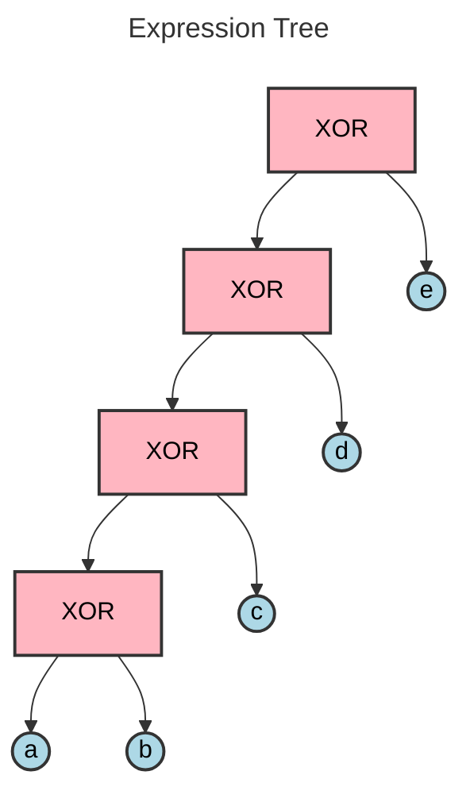
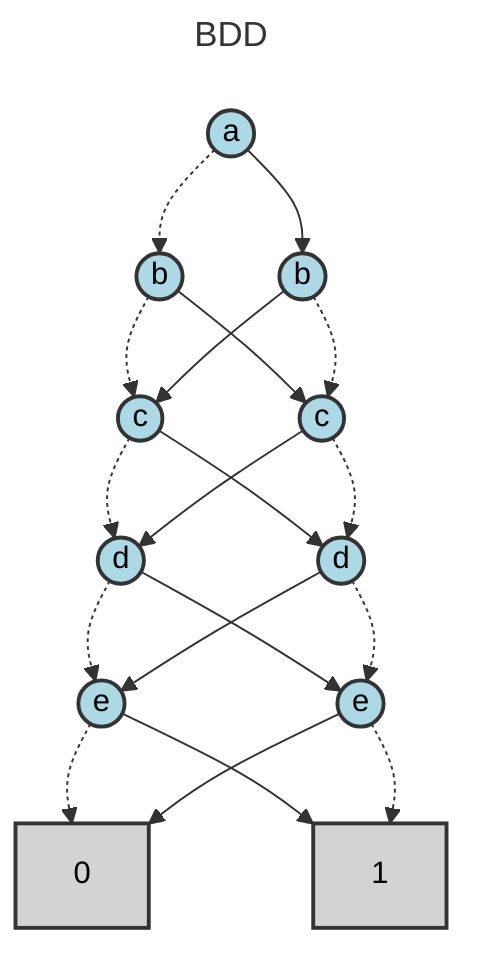

# BDD Analysis Report

## Original Expression

```
a XOR b XOR c XOR d XOR e
```

## Expression Tree

The following diagram shows the parse tree of the logical expression:



## Binary Decision Diagram (BDD)

The following diagram shows the optimized BDD representation:



## Analysis Summary

- **Variables**: 5
- **BDD Nodes**: 11
- **Expression**: a XOR b XOR c XOR d XOR e

## BDD Node Table

The following table shows the internal structure of the BDD with node relationships:

| Index | Variable | False Child | True Child | Type |
|-------|----------|-------------|------------|------|
| 0 | a | 2 | 1 | Variable |
| 1 | b | 3 | 4 | Variable |
| 2 | b | 4 | 3 | Variable |
| 3 | c | 5 | 6 | Variable |
| 4 | c | 6 | 5 | Variable |
| 5 | d | 7 | 8 | Variable |
| 6 | d | 8 | 7 | Variable |
| 7 | e | 9 | 10 | Variable |
| 8 | e | 10 | 9 | Variable |
| 9 | - | - | - | Terminal(1) |
| 10 | - | - | - | Terminal(0) |

**Note**: Nodes are ordered topologically (parents before children) with terminal nodes at the end.
